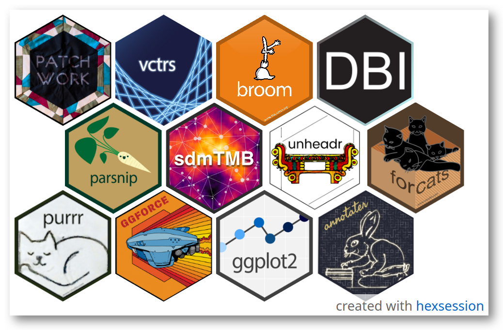

<!-- README.md is generated from README.Rmd. Please edit that file -->

# hexsession 

<!-- badges: start -->

[](https://lifecycle.r-lib.org/articles/stages.html#experimental)
[](https://CRAN.R-project.org/package=hexsession)
<!-- badges: end -->

The goal of hexsession is to create a tile of hexagonal logos for
packages installed on your machine. Tiles can be created for a set of
packages specified with a character vector, or for the loaded packages
in your session (all packages attached to the search path except for
base packages).

## Installation

You can install the development version of hexsession like so:

``` r
# install.packages("remotes)
remotes::install_github("luisdva/hexsession")
```

## Using hexsession

With hexsession installed, we can create a self-contained HTML file with
tiled hex logos for all loaded packages in a session. If a package does
not have a logo bundled in `man/figures/` or if the image cannot be
found easily, a generic-looking logo with the package name will be
generated.

- svg files are internally converted to png
- If the images bundled with a package do not match ‘logo’, a users are
  prompted to specify which file to use.

For a given session with libraries loaded in addition to base packages:

``` r
library(hexsession)
make_tile()

# custom set of packages
make_tile(packages=c("terra","sf","tidyr"))
```

The `make_tile()` function will render the HTML output in a new folder
in the working directory using a Quarto template file that will also be
copied to this new directory.

For a session with the following packages loaded:

``` r
library(annotater)
library(ggforce)
library(purrr)
library(forcats)
library(unheadr)
library(sdmTMB)
library(parsnip)
library(DBI)
library(broom)
library(vctrs)
library(patchwork)


hexsession::make_tile()
```

The output would look like this:  *I don’t
know how to show the rendered interactive file on the GitHub readme, if
anyone does please let me know 😅.*

Once downloaded to your machine and opened in a browser, the
[hexout_example.html](inst/extdata/hexout_example.html) shows the
interactive, responsive HTML version with cool hover effects that adapts
to the size of the browser window and includes hyperlinks to each
package website.

To save a static version of the hex tile, we call `snap_tile()` with a
path to the output image and optionally, height and width values to
change the viewport size.

The result:



### Dark mode

To draw the tiles on a dark background, set `dark_mode` to `TRUE` when
creating or capturing your hex logos.

``` r
hexsession::make_tile(dark_mode = TRUE)
hexsession::snap_tile("test.png",dark_mode = TRUE)
```

## Notes

This packages depends on working installations of magick, Quarto, and
chromote and thus needs a Chromium-based web browser (e.g., Chrome,
Chromium, Opera, or Vivaldi) installation.

hexsession is very much work in progress and highly experimental. I am
still learning good-practices for packages that create files and
directories, use system commands, and launch browser sessions.

All feedback is welcome in any form (issues, pull requests, etc.)

### Credit and LLM disclosure statement

- css and html code for the responsive hex grid comes from [this
  tutorial](https://css-tricks.com/hexagons-and-beyond-flexible-responsive-grid-patterns-sans-media-queries/)
  by Temani Afif.

- the javascript code to populate the divs in the Quarto template was
  written with input from the Claude 3.5 Sonnet LLM running in the
  Continue extension in the Positron IDE.
